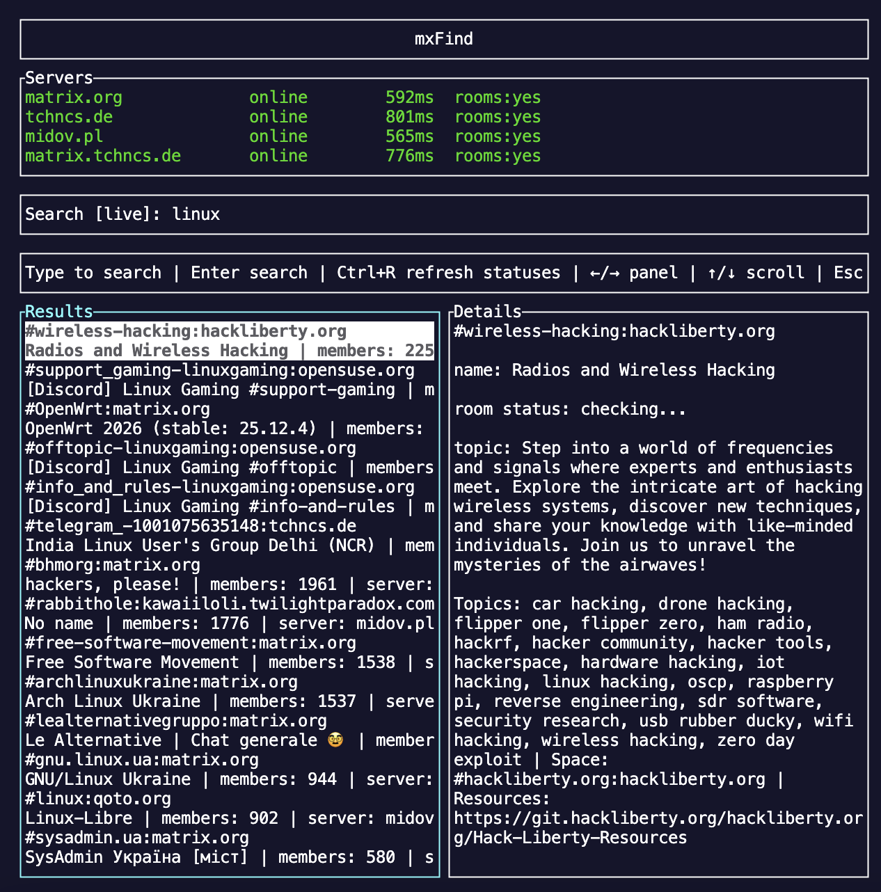

# mxfind

[English](README.md) | [Русский](README.ru.md)

**Поиск публичных Matrix-комнат прямо из терминала.**

`mxfind` - небольшая Rust CLI/TUI-утилита для поиска публичных Matrix-комнат через public room directories разных homeserver'ов. Можно запускать интерактивный TUI, искать live по серверам или собрать локальный SQLite-индекс для быстрых повторных запросов.



## Установка

Скачайте готовый бинарник под свою систему:

https://github.com/Sovinskii28/mxFind/releases/latest

Linux:

```sh
curl -L https://github.com/Sovinskii28/mxFind/releases/latest/download/mxfind-linux-x86_64.tar.gz -o mxfind-linux-x86_64.tar.gz
tar -xzf mxfind-linux-x86_64.tar.gz
chmod +x mxfind
./mxfind
```

macOS Apple Silicon:

```sh
curl -L https://github.com/Sovinskii28/mxFind/releases/latest/download/mxfind-macos-arm64.tar.gz -o mxfind-macos-arm64.tar.gz
tar -xzf mxfind-macos-arm64.tar.gz
chmod +x mxfind
./mxfind
```

macOS Intel:

```sh
curl -L https://github.com/Sovinskii28/mxFind/releases/latest/download/mxfind-macos-x86_64.tar.gz -o mxfind-macos-x86_64.tar.gz
tar -xzf mxfind-macos-x86_64.tar.gz
chmod +x mxfind
./mxfind
```

Windows:

Скачайте `mxfind-windows-x86_64.zip` из последнего релиза, распакуйте и запустите:

```powershell
.\mxfind.exe
```

Если хотите запускать команду откуда угодно, переместите бинарник в директорию из `PATH`.

## Быстрый старт

Открыть live TUI:

```sh
mxfind
```

Искать из командной строки:

```sh
mxfind search rust
mxfind search linux --limit 10
mxfind search security --json
```

Собрать локальный индекс и искать по нему:

```sh
mxfind index
mxfind search rust --local
mxfind tui --local
```

Проверить доступность homeserver'ов:

```sh
mxfind status
mxfind status --server matrix.org
```

Посмотреть комнату из локального индекса:

```sh
mxfind room '#rust:matrix.org'
mxfind room '#rust:matrix.org' --json
```

## Команды

| Команда | Что делает |
| --- | --- |
| `mxfind` | Открывает live terminal UI. |
| `mxfind tui` | Открывает terminal UI явно. |
| `mxfind search <query>` | Ищет публичные Matrix-комнаты. |
| `mxfind index` | Сохраняет публичные комнаты из настроенных homeserver'ов в SQLite. |
| `mxfind room <id-or-alias>` | Показывает одну комнату из локального индекса. |
| `mxfind status` | Проверяет доступность public directory у homeserver'ов. |

## Полезные аргументы

Поиск:

```sh
mxfind search rust --limit 20
mxfind search rust --live
mxfind search rust --local
mxfind search rust --json
mxfind search rust --config config.toml
mxfind search rust --db ./mxfind.sqlite
```

Индексация:

```sh
mxfind index
mxfind index --prune
mxfind index --verbose
mxfind index --config config.toml
mxfind index --db ./mxfind.sqlite
```

TUI:

```sh
mxfind tui
mxfind tui --local
mxfind tui --config config.toml
mxfind tui --db ./mxfind.sqlite
```

Статус серверов:

```sh
mxfind status
mxfind status --server matrix.org
mxfind status --json
mxfind status --config config.toml
```

Карточка комнаты:

```sh
mxfind room '#rust:matrix.org'
mxfind room '!abcdef:matrix.org' --json
mxfind room '#rust:matrix.org' --db ./mxfind.sqlite
```

## Как работает поиск

В Matrix нет единого глобального каталога всех публичных комнат. Каждый homeserver может отдавать свой public room directory, а часть серверов ограничивает или отключает его.

`mxfind` поддерживает два режима:

- **Live search** - напрямую спрашивает настроенные homeserver'ы.
- **Local search** - ищет в SQLite-базе, созданной через `mxfind index`.

Локальный поиск удобнее для повторных запросов. Live search удобнее, когда нужно быстро посмотреть результат без подготовки базы.

## Конфигурация

Путь по умолчанию:

```text
~/.config/mxfind/config.toml
```

Пример:

```toml
servers = ["matrix.org", "tchncs.de", "midov.pl", "matrix.tchncs.de"]
```

Использование:

```sh
mxfind search linux --live --config config.toml
mxfind index --config config.toml
mxfind tui --config config.toml
```

Если конфига нет, `mxfind` использует встроенный список серверов.

## База данных

Путь по умолчанию:

```text
~/.local/share/mxfind/mxfind.sqlite
```

В базу сохраняются room ID, alias, name, topic, количество участников, исходный homeserver и timestamps обнаружения.

`mxfind index` работает инкрементально. `mxfind index --prune` удаляет устаревшие комнаты только для homeserver'ов, которые успешно просканировались в текущем запуске.

## Сборка из исходников

Нужно:

- Rust stable
- Cargo

Сборка:

```sh
git clone https://github.com/Sovinskii28/mxFind.git
cd mxFind
cargo build --release
./target/release/mxfind
```

Установить из локального checkout:

```sh
cargo install --path .
mxfind
```

Запуск во время разработки:

```sh
cargo run
cargo run -- search rust
cargo run -- tui
```

Проверки:

```sh
cargo fmt --check
cargo test
```

## Лицензия

MIT. См. [LICENSE](LICENSE).
